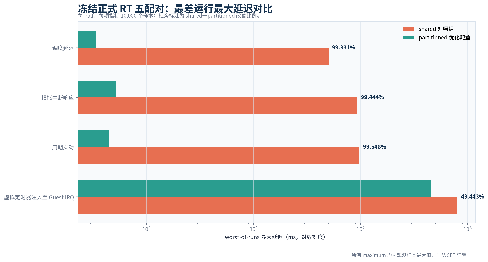
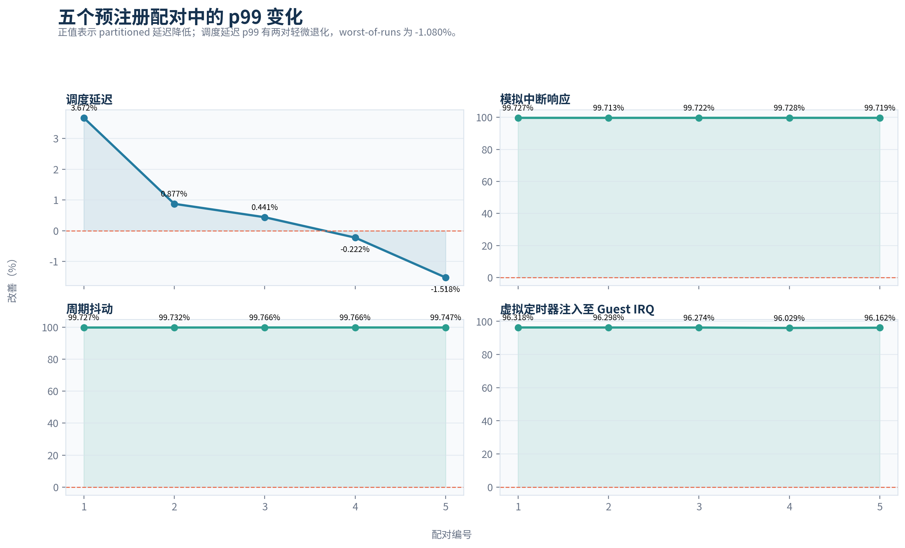
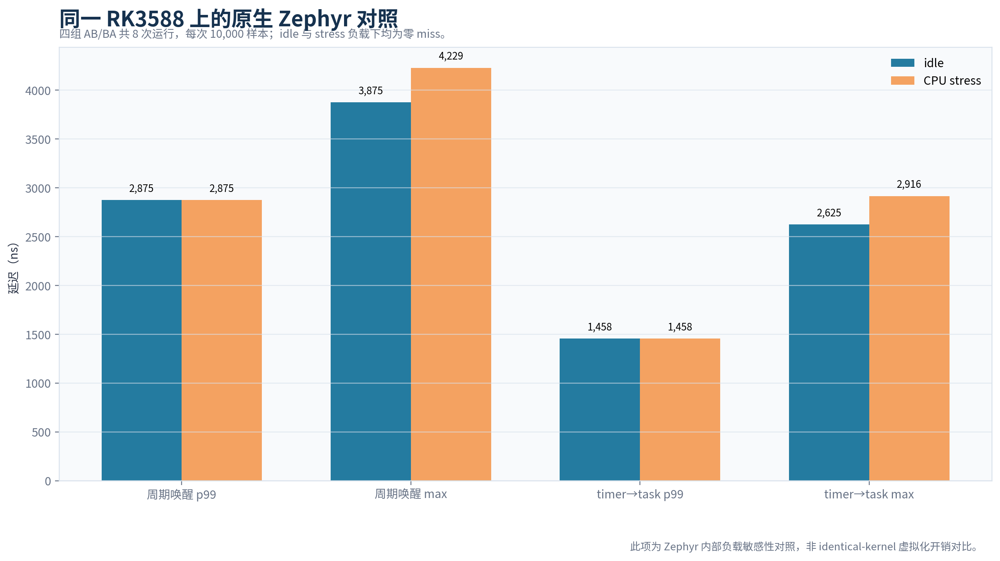
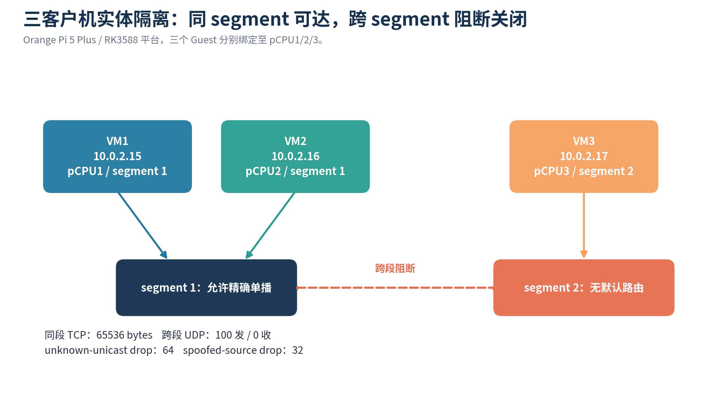
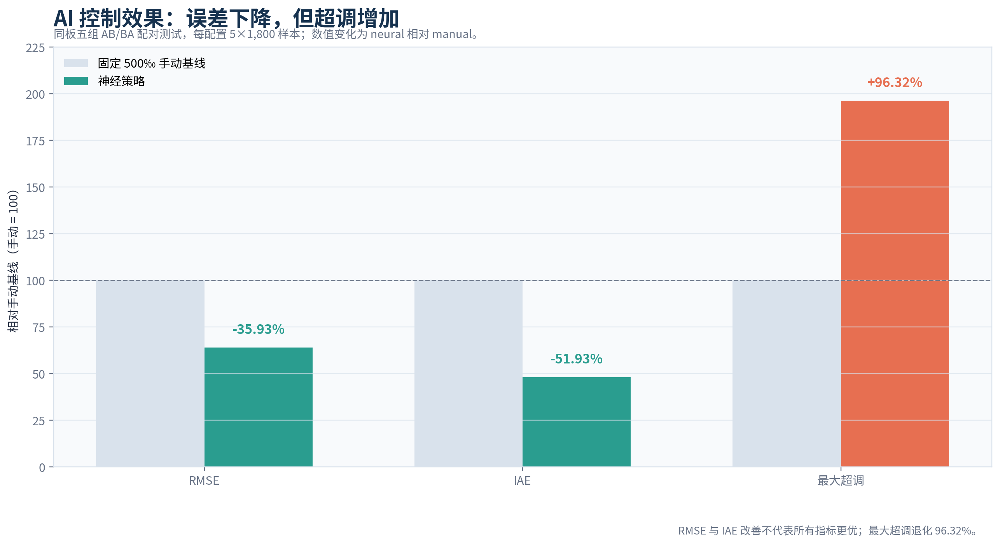
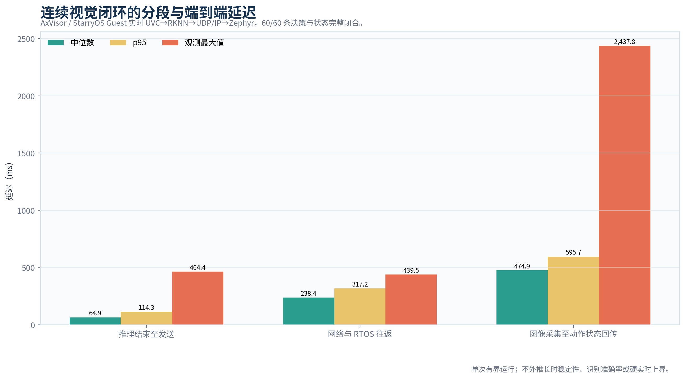
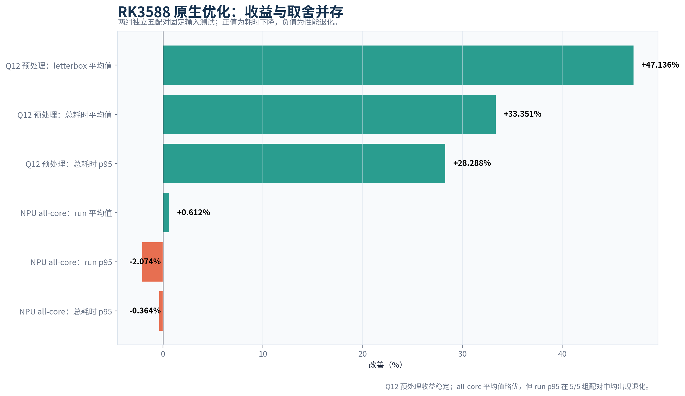
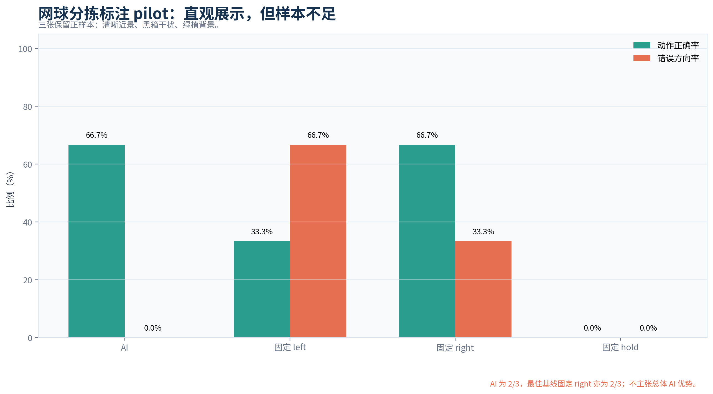
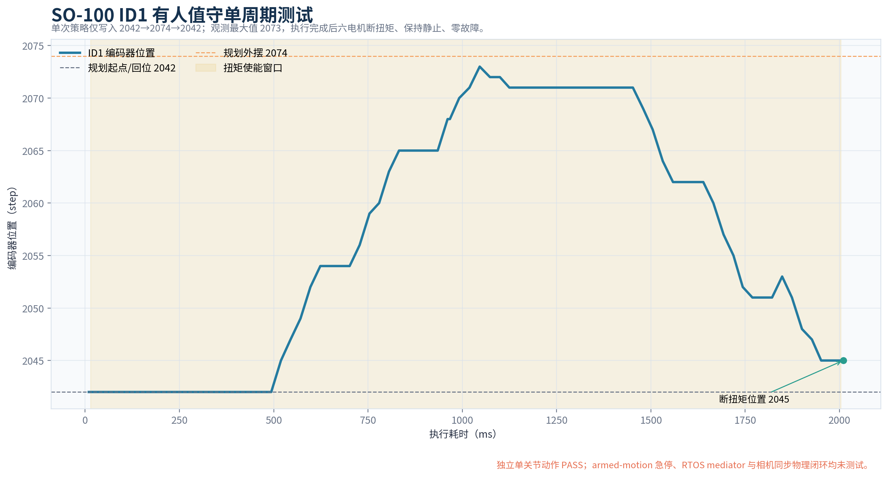

# 智能化工控混合系统比赛测试报告

## Orange Pi 5 Plus / RK3588 实测、回归与证据边界

本报告依据 `competition/requirement.md` 汇总启动、实时性、原生 RTOS、客户机通信、可靠性、隔离、AI 推理、控制效果、连续视觉与 SO-100 的测试证据。数值由 `competition/submission/data/evidence-snapshot.json` 基于保留的 JSON 结果归一化生成；除明确标注的 current smoke 外，不把历史 clean commit 的硬件结果描述为当前 HEAD 重跑。

# 1. 结论总表

| 测试域 | 样本或持续时间 | 结果 | 等级 |
| --- | ---: | --- | --- |
| Upstream PR CI | 主流水线 35 个任务 | 35/35 成功；AArch64 IVC 与 Orange Pi 5 Plus 相关任务成功 | PASS |
| AxVisor 正式 RT | 5 组 AB/BA；每项每 half 10,000 样本 | M2 exit gate 通过；4 项 worst maximum 均改善 | FROZEN FORMAL |
| AxVisor 双 soak | 1,864.677 秒 + 1,845.735 秒 | host/guest/direct IRQ 记录完全配对 | FROZEN FORMAL |
| 原生 Zephyr | 4 组 AB/BA，共 8×10,000 样本 | idle/stress 均 0 miss、0 early wake | PASS |
| 原生 Zephyr soak | 1,817.822 秒、10,000 样本 | 0 miss、0 early wake | PASS |
| 当前源 IVC reset | 120 条控制 | accepted=120、applied=120、成功率 100.0% | PASS |
| 故障注入 | 3 类 campaign，各 3 次 | ACK-loss、typed ERROR、restart gate 均通过 | PASS |
| RT-Thread / FreeRTOS | 各 20 条板端控制 | 均 20/20，无 timeout、retransmission、error | PASS |
| 实体 segment 隔离 | 同段 TCP + 100 个跨段 UDP + L2 probes | 65,536 bytes；跨段接收 0；策略 drop 命中 | PASS |
| AI 控制对比 | 五组 AB/BA；每配置 5×1,800 样本 | RMSE、IAE 改善；最大超调退化 | MIXED |
| UVC→RKNN | 60.1 秒 | 965 帧、483 次推理、零错误 | PASS |
| 跨 Guest 连续视觉 | 60 条 decision | 60/60 accepted/applied/status，retry=0 | PASS |
| 标注场景 | 3 个正样本 | AI 2/3，固定 right 2/3 | PILOT |
| SO-100 ID1 | 有人值守单周期 | 2042→2074→2042 计划轨迹，安全断扭矩 | LIMITED PASS |
| 摄像头同步物理闭环 | 未执行 | 无统一 sequence 与同步现场视频 | BLOCKED |

# 2. 测试方法与证据等级

测试遵循三类隔离原则。第一，源版本隔离：每个硬件 campaign 绑定 source commit，当前分支只引用、校验与再分析，不重写来源。第二，运行条件隔离：AB/BA 配对同时保留顺序、负载、样本数、warmup 与频率条件，禁止把不同内核或不同平台的绝对值当作唯一因果证据。第三，主张隔离：PASS 只覆盖预注册 gate；PILOT 表示可演示但样本不足；BLOCKED 表示必要证据尚不存在。

性能统计同时报告 median、p95、maximum 与逐配对方向。maximum 均称为 observed maximum，不称 WCET。跨 Guest 端到端时间使用 StarryOS 同侧 monotonic clock 包围发起和匹配响应，不将两个客户机的独立时钟 epoch 直接相减。板端测试前后包含 Linux 可达性、文件哈希、`sync`、启动 marker 和恢复检查。

# 3. AxVisor 正式实时性 campaign

正式 campaign 固定于 `c82da8464ab69e7da95e9be08293559e67b28fac`。每个指标在 shared 与 partitioned 两个 half 各采集 10,000 样本，完成 5 个预注册 AB/BA 配对。M2 exit gate 通过。

| 指标 | shared worst max | partitioned worst max | 改善 | improved max pairs |
| --- | ---: | ---: | ---: | ---: |
| 调度延迟 | 50.300542 ms | 0.336583 ms | 99.331% | 5/5 |
| 模拟中断响应 | 93.470375 ms | 0.519875 ms | 99.444% | 5/5 |
| 周期抖动 | 97.742000 ms | 0.441584 ms | 99.548% | 5/5 |
| 虚拟定时器注入至 Guest IRQ | 804.099041 ms | 454.771333 ms | 43.443% | 5/5 |

最差运行 maximum 在四项指标上均改善，但 p99 不是全部同向。调度延迟五个配对分别为 +3.672%、+0.877%、+0.441%、-0.222%、-1.518%，worst p99 为 -1.080%；模拟中断的 5 个 p99 配对、周期抖动的 5 个 p99 配对与虚拟定时器注入的 5 个 p99 配对均在预注册 5% 非退化门内。

# 4. p99 配对与长稳结果

shared soak 持续 1,864.677 秒，得到 231,896 条 host records、229,099 条 guest records 与 229,099 个 direct IRQ pair；partitioned soak 持续 1,845.735 秒，得到 436,887 条 host records、434,108 条 guest records 与 434,108 个 direct IRQ pair。两次运行均约 30 分钟，覆盖持续中断与 Guest 记录关联。

这组 soak 支持长时间稳定性与记录完整性，不替代 WCET 分析，也不证明超过当前持续时间的故障率。对于调度 p99 的两对轻微退化，保留原始配对是必要的，因为仅展示 99.331% 的 worst maximum 改善会掩盖尾部分位的取舍。

# 5. 正式 RT 证据适用性审计

当前材料 HEAD 未执行正式 RT 重跑。审计比较 34 个预注册源码输入的 Git blob，33 个相同，1 个变化为 `competition/ivc/orangepi/restore-linux.sh`。该文件只增加 linked-worktree 配置解析与 WSL/Windows Python 选择，属于 post-run Linux 恢复编排，未装入被测运行时镜像。

正式提交 `c82da8464ab69e7da95e9be08293559e67b28fac` 不是当前 HEAD 的祖先，因此 delivery verifier 以 exit code 2 拒绝当前性能声明。这是预期保护门，而非测试失败。报告只把数值归属到冻结源提交；若要升级为当前 HEAD 结论，必须重新执行 5 组配对和双 soak。

# 6. 原生 Zephyr 同板基线

平台为 Orange Pi 5 Plus / RK3588，Zephyr 4.3.0，board=`roc_rk3588_pc`，Cortex-A55 CPU0，timer=24 MHz AArch64 architected counter。周期为 1,000 µs，warmup=100，每次 samples=10,000。idle 与 CPU stress 按 4 组 AB/BA 运行，共 8 次。

| 指标 | idle 中位数 | CPU stress 中位数 | 变化 |
| --- | ---: | ---: | ---: |
| 周期唤醒 p99 | 2,875 ns | 2,875 ns | 0.000% |
| 周期唤醒 max | 3,875 ns | 4,229 ns | +8.503% |
| timer→task p99 | 1,458 ns | 1,458 ns | 0.000% |
| timer→task max | 2,625 ns | 2,916 ns | +11.086% |

8 次运行的 timer miss 与 early wake 都为 0。独立 soak 持续 1,817.822 秒，10,000 个样本同样为 0 miss。该基线与虚拟化 campaign 的任务结构等价，但内核、驱动和测量路径不同，因此只用于同板 RTOS 量级与压力敏感性对照，不宣称 identical-kernel 虚拟化开销。

# 7. 当前源 IVC 与实际 VM reset

当前源 smoke 绑定 `598b357f92c848e669c12cca830a4d08d0a50e36`，StarryOS 使用 2 vCPU。reset 前发送 20 个样本，AxVisor 执行 actual VM reset，reset 后完成 100 个样本。汇总为 accepted=120、applied=120、STATUS sent=122、ACK sent=122、ERROR sent=1、成功率 100.0%。full-loop p99 为 24,692 µs，maximum 为 344,033 µs。

额外的 RTOS 板端 smoke 使用相同 IVC/1 语义。RT-Thread 20/20 accepted/applied，full-loop p50=2,285 µs、p99=16,693 µs、max=50,406 µs；FreeRTOS 20/20 accepted/applied，full-loop p50=1,929 µs、p99=16,647 µs、max=50,663 µs。两者均为 0 retransmission、0 timeout、0 error。

# 8. 通信可靠性与故障注入

| campaign | 重复次数 | 预注册 gate | 关键行为 |
| --- | ---: | --- | --- |
| ACK-loss | 3 | PASS | 首次 ACK 丢失后重传同一 sequence；动作只应用一次 |
| typed ERROR | 3 | PASS | version、length、checksum、type、session 错误映射为 ERROR 后可继续控制 |
| guest restart | 3 | PASS | 真实 reset 后新 session 恢复；旧 CONTROL、STATUS、ACK 不污染新会话 |

ACK-loss 源提交为 `bac4ad16b4adf673942e6c31897872c2c5c116dc`，typed ERROR 为 `29be4fc4c8668b8e94cd253fb4484bbeba1d8481`，restart 为 `6adf49e09ce91b53d2573cb8d34c60dc6a9ec47c`。每类均完成 3 次预注册物理运行并通过最终 Linux 恢复 gate。

判定重点不是是否出现重传，而是重复包不得重复执行 plant step 或 actuator side effect；ERROR 也不得把端点永久置入不可恢复状态。超时 500,000 µs 触发 actuator=0 safe fallback，恢复后由新 session 从 sequence 1 重新建立控制。

# 9. 实体板网络隔离

三客户机拓扑把 VM1 和 VM2 放入 segment 1，把 VM3 放入 segment 2。VM1/VM2 的 pCPU 分别为 1/2，VM3 为 3；IP 为 `10.0.2.15/24`、`10.0.2.16/24`、`10.0.2.17/24`。

同 segment TCP 测试传输 65,536 bytes。跨 segment UDP 测试由 VM3 发送 100 个探针，VM1 监听 7 秒并接收 0，同时发送侧计数确认流量实际发出。主动 L2 探针包含 32 个 known cross-segment、32 个 unknown-unicast、32 个 spoofed-source；策略计数器为 drop unknown-unicast=64、drop spoofed-source=32。

测试通过当前虚拟交换与 segment 规则，但没有物理交换机或独立 NIC 参与，因此结论限定为虚拟网络隔离。

# 10. 神经网络后端一致性

三后端共用 `thermal-4x6x1-v1`、canonical weights、golden vectors 与 IVC payload。RKNN NPU 5 次运行共 9,000 样本，success=100.0%，device p99 中位数 1,670 µs，full-loop p99 中位数 13,502 µs。ONNX Runtime CPU 5 次运行共 9,000 样本，全部 acknowledged，wall p99 中位数 174.709 µs，full-loop p99 中位数 12,251 µs。

full-loop p99 的五个配对中有 2 个对 RKNN 有利，这说明端到端尾延迟受运行时、系统噪声与网络控制路径共同影响，不能只凭设备推理 p99 推断完整闭环优劣。测试的主要结论是模型语义和协议输出跨后端一致，性能取舍应按实际 SLO 决定。

# 11. AI 与手动控制效果对比

五组 AB/BA 采用固定 500 permille 手动基线与 neural 策略，每个配置 5×1,800 样本。

| 指标 | manual | neural | neural 相对变化 | 判定 |
| --- | ---: | ---: | ---: | --- |
| RMSE | 9,258.905661 mC | 5,932.491362 mC | -35.926646% | 改善 |
| IAE | 1,429,224.7 mC·s | 686,993.4 mC·s | -51.932443% | 改善 |
| 最大超调 | 6,840 mC | 13,428 mC | +96.315789% | 退化 |

结果满足至少两项量化指标对比，但结论是 mixed，而不是 AI 全面优胜。后续模型调整必须把超调作为显式代价，并用新数据重新验证。

# 12. USB 摄像头与 RKNN 长稳

UVC→RKNN 测试绑定 `1c37317735f8399073f453bf9e5efa5ce51773f5`。实测持续 60.1 秒，captured=965、inferences=483，capture=16.06 fps、inference=8.04 fps，decode errors=0、inference errors=0，infer p95=75.1 ms。该结果验证了已接入 USB 摄像头的持续采集和板端 NPU 推理，而不是静态图片替代。

测试仍应区分采集帧率与推理帧率：当前采用抽帧或生产者/消费者节奏，不能把 16.06 fps 写成模型推理吞吐。60.1 秒能够发现立即性解码和推理错误，但不代表数小时热稳或温控边界。

# 13. 跨 Guest 连续视觉闭环

跨 Guest run 绑定 `65bdeed8da80459808246fbf3fae85c56196ff2f`。60 个 decision 均被 RTOS accepted/applied，status sent=60，retry=0；动作分布为 left=1、hold=59。

| 延迟段 | median | p95 | observed max |
| --- | ---: | ---: | ---: |
| 推理结束至发送 | 64.894 ms | 114.292 ms | 464.386 ms |
| 网络与 RTOS 往返 | 238.375 ms | 317.179 ms | 439.526 ms |
| 图像采集至动作状态回传 | 474.923 ms | 595.729 ms | 2,437.752 ms |

所有时间由 StarryOS 同侧 monotonic clock 的 round trip 计算，避免跨 guest 时钟偏移。observed max 2,437.752 ms 是单次有界运行中的样本最大值，不外推长期稳定性或硬实时上界。该 run 的动作状态来自虚拟执行器，没有物理 SO-100。

# 14. 连续视觉性能优化

Q12 预处理路径在两组独立五配对中稳定受益：letterbox 平均值由 81.25 ms 降到 42.92 ms，配对中位改善 47.136%；总耗时平均值由 115.53 ms 降到 77.02 ms，改善 33.351%；总耗时 p95 由 137.41 ms 降到 98.58 ms，改善 28.288%。三项均为 5/5 favorable。

NPU all-core 相对 core0 的 run 平均值从 19.61 ms 降到 19.49 ms，改善 0.612%，4/5 favorable；run p95 从 23.14 ms 增到 23.63 ms，退化 2.074%，0/5 favorable；总耗时 p95 从 115.88 ms 增到 115.98 ms，退化 0.364%，1/5 favorable。

据此，Q12 预处理可作为稳定优化候选，all-core 只能视为均值与尾延迟的取舍，不能默认启用。

# 15. 标注网球分拣 pilot

3 个保留正样本覆盖清晰近景、黑箱干扰和绿植背景。AI 正确 2/3，准确率 66.667%，wrong direction=0.0%，missed action=1；固定 left 正确率 33.333%、wrong direction=66.667%；固定 right 正确率 66.667%、wrong direction=33.333%；固定 hold 正确率 0.0%、missed action=100.0%。

AI 与最佳固定基线同为 2/3，因此 overall AI superiority demonstrated=false。pilot 适合解释动作语义和现场画面，不适合统计主张。正式扩展至少需要冻结正负样本、分层场景、独立标注与错误类型，并在采集前写明通过门限。

# 16. SO-100 有人值守单周期

SO-100 通过 USB Control 连接 Orange Pi，12 V 电源独立上电。测试前机械臂固定、工作区清空、人员在场、断电开关可触达。计划轨迹为 ID1 2042→2074→2042，position tolerance=8。

trace 起始为 configured-disarmed position=2042、torque=false；上电后向外运动，观测最大位置 2073；回程监测最终位置 2045，2,010.081 ms 时断扭矩，postflight 稳定位置 2047。全部 status=0，结束 torque disabled=true。

通过项仅为 id1-single-cycle。full-arm motion、armed-motion estop、rtos mediator 与 camera-synchronized physical loop 均为 not-tested。该证据不能与 60 条视觉 run 拼接成同一次物理闭环。

# 17. 复现、自动校验与 upstream CI

材料生成前执行证据抽取器，对 21 个输入 JSON 计算 SHA-256，并断言正式 RT、当前 reset、原生 Zephyr、隔离、UVC、连续视觉、优化、pilot 与 SO-100 的关键 gate。图表生成脚本仅读取归一化快照。中文润色清单记录 `gemini-3.7-flash-high`、effort=high、conversation ID、usage 与输入输出哈希。

| CI 字段 | 记录 |
| --- | --- |
| Upstream PR | `rcore-os/tgoskits#2182` |
| 代码 HEAD | `75d8f3918580471a3451b29ca5d33a015bd5bb81` |
| CI 运行 | `32794757246`；success；主流水线 35 个任务全部成功 |
| 完整地址 | <https://github.com/rcore-os/tgoskits/actions/runs/32794757246> |
| 机器摘要 | `competition/results/upstream-pr-2182-ci-20260825/summary.json` |

关键通过项包括 Formatting、Synchronization lint、Workspace Incremental Clippy、Workspace std tests、AxVisor QEMU aarch64 IVC、AxVisor QEMU aarch64 virtio-blk/timer stress，以及 Orange Pi 5 Plus Linux、StarryOS 与 robot 板卡任务。

| PR 修复提交 | 成果分支 patch-equivalent 提交 |
| --- | --- |
| `cf52846efe04166f17282e5fc10426be6d64e947` | `adf9e671dd93f6b8c315aa06d732ede1f6d54d00` |
| `75d8f3918580471a3451b29ca5d33a015bd5bb81` | `7b5c59af5c199dff4c95166ef4e743cdc6d00b1c` |

PR CI 仅作为代码集成有效性的证据，不等同于在成果分支文档提交上对正式 RT 五配对与双 soak 进行的重跑。

离线复现流程先运行 Python 单元测试、证据快照重建、图表重建、PDF 构建与校验；硬件复现流程再依次取得 board lease、确认 Linux 状态、上传并核验镜像、执行 `sync`、重启至 AxVisor、采集 marker 并恢复 Linux。完整命令见随附复现说明。

# 18. 限制、风险与判定

本报告有四个明确限制。第一，正式 RT 数据没有在当前 HEAD 重跑，不能把 blob 审计替代板测。第二，原生 Zephyr 与虚拟化环境不是 identical-kernel，绝对值差异不能直接解释为 hypervisor overhead。第三，标注 pilot 只有 3 个正样本，不能证明 AI 总体优势。第四，SO-100 与连续视觉来自不同运行，且 SO-100 没有 RTOS mediator、同步相机或 armed-motion estop 证据。

在这些限制内，实时性、IP 通信、可靠性、虚拟隔离、神经网络部署、虚拟动作闭环、UVC/NPU 与有人值守单关节动作均有机器可读证据。下一轮最高价值测试是当前 HEAD 正式 RT 重跑，以及带统一 sequence 和现场急停记录的 摄像头→StarryOS→IVC/1→RTOS→SO-100 同步闭环。
